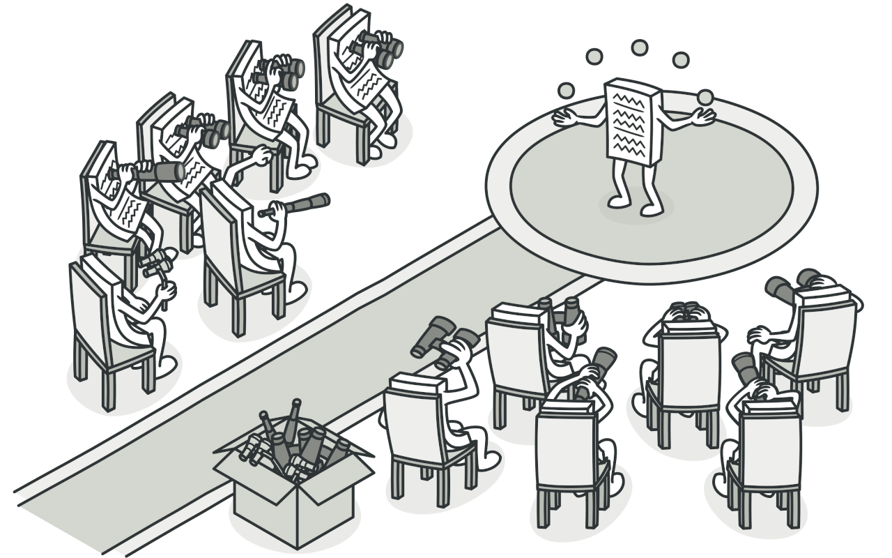
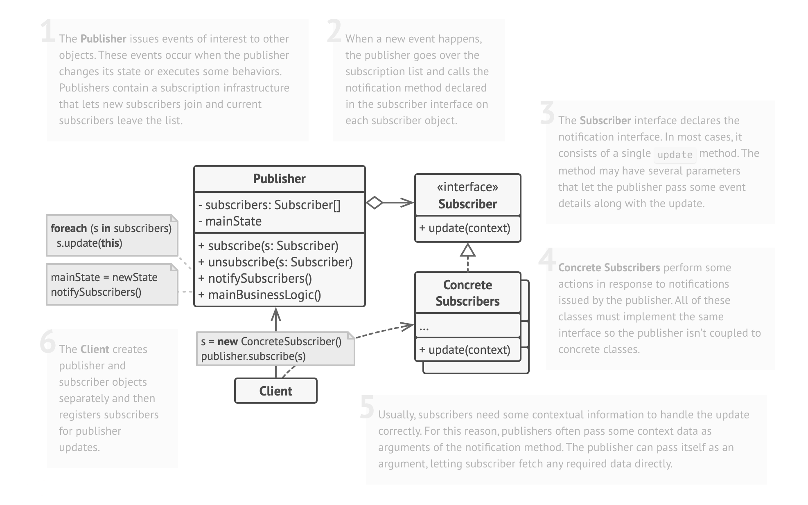

- [1. Intent](#1-intent)
- [2. Example](#2-example)
- [3. Structure](#3-structure)
- [4. Pseudocode](#4-pseudocode)
- [5. Pros and Cons](#5-pros-and-cons)
  - [5.1. Example: Messaging System with Observer Pattern](#51-example-messaging-system-with-observer-pattern)
  - [5.2. Pros](#52-pros)
  - [5.3. Cons](#53-cons)

# 1. Intent
**Observer** là một mẫu thiết kế hành vi cho phép bạn xác định cơ chế đăng ký để thông báo cho nhiều đối tượng về bất kỳ sự kiện nào xảy ra với đối tượng mà chúng đang theo dõi.


# 2. Example

- **Hệ thống giám sát thời tiết:** Sử dụng Mẫu Observer để tạo các trạm thời tiết là Subject và các hiển thị thời tiết khác nhau (ví dụ: kênh truyền hình thời tiết, ứng dụng di động, trang web) là Observer. Khi dữ liệu thời tiết thay đổi, tất cả các hiển thị sẽ tự động được cập nhật với thông tin thời tiết mới nhất.c thuật toán sắp xếp khác nhau như Bubble Sort, Merge Sort và Quick Sort.

- **Theo dõi thị trường chứng khoán:** Thực hiện một hệ thống thị trường chứng khoán nơi nhiều nhà đầu tư và nhà giao dịch đăng ký làm Observer cho các biểu tượng chứng khoán khác nhau. Khi giá cổ phiếu của một biểu tượng đã đăng ký thay đổi, tất cả nhà đầu tư và nhà giao dịch sẽ nhận thông báo về thay đổi giá.

- **Cập nhật mạng xã hội:** Áp dụng Mẫu Observer trong một nền tảng mạng xã hội nơi người dùng có thể theo dõi người dùng hoặc trang. Mỗi bài viết của người dùng là Subject và người theo dõi là Observer, nhận thông tin cập nhật khi có bài viết mới.

- **Event và Achievements trong game:** Trong một trò chơi nhiều người chơi, người chơi có thể đăng ký nhận thông báo về các sự kiện hoặc thành tựu trong trò chơi. Các sự kiện trong trò chơi là Subject và người chơi là Observer, nhận thông báo khi có sự kiện quan trọng diễn ra.

# 3. Structure


# 4. Pseudocode
```php
# Step 1: Define the Subject (Observable) Interface
interface Subject:
    method addObserver(Observer observer)
    method removeObserver(Observer observer)
    method notifyObservers()

# Step 2: Define the Observer Interface
interface Observer:
    method update(data)

# Step 3: Implement the Concrete Subject (Observable) Class
class ConcreteSubject implements Subject:
    private observers: list of Observer
    private data

    method addObserver(Observer observer):
        # Add the observer to the list of observers
        add observer to observers

    method removeObserver(Observer observer):
        # Remove the observer from the list of observers
        remove observer from observers

    method notifyObservers():
        # Notify all registered observers by calling their update method
        for each observer in observers:
            observer.update(data)

    method setData(data):
        # Set the data and notify observers
        this.data = data
        notifyObservers()

# Step 4: Implement the Concrete Observer Class(es)
class ConcreteObserver implements Observer:
    private name

    constructor(name):
        this.name = name

    method update(data):
        # Process the updated data received from the subject
        print name + " received update: " + data

# Usage
subject = new ConcreteSubject()

observer1 = new ConcreteObserver("Observer 1")
observer2 = new ConcreteObserver("Observer 2")

# Register observers to the subject
subject.addObserver(observer1)
subject.addObserver(observer2)

# Set the data in the subject (this will notify the observers)
subject.setData("New Data")

# Output:
# Observer 1 received update: New Data
# Observer 2 received update: New Data

# Unregister observer2 from the subject
subject.removeObserver(observer2)

# Set the data in the subject (this will notify only observer1)
subject.setData("Updated Data")

# Output:
# Observer 1 received update: Updated Data

```
# 5. Pros and Cons
## 5.1. Example: Messaging System with Observer Pattern
Trong ví dụ này, chúng ta sẽ triển khai một hệ thống tin nhắn, trong đó người dùng có thể đăng ký đăng ký vào các kênh khác nhau và nhận tin nhắn khi có tin nhắn mới được đăng vào các kênh đó.
## 5.2. Pros
- Flexibility and Reusability:
  - Mẫu Observer cho phép người dùng đăng ký vào các kênh khác nhau và nhận tin nhắn mà không cần thay đổi logic cốt lõi của hệ thống tin nhắn. Các kênh mới có thể được thêm vào trong tương lai, và người dùng có thể đăng ký vào chúng mà không ảnh hưởng đến mã nguồn hiện tại.
  - Hệ thống tin nhắn có thể được sử dụng trong các ứng dụng khác nhau, và người dùng có thể đăng ký vào các kênh khác nhau dựa trên sở thích của họ, thúc đẩy tính tái sử dụng mã nguồn.
- Separation of Concerns:
  -  Mẫu Observer phân tách logic cốt lõi của hệ thống tin nhắn với giao diện người dùng. Hệ thống tin nhắn hoạt động như Subject, trong khi người dùng là Observer. Sự phân tách này cho phép dễ dàng bảo trì, vì các thay đổi vào hệ thống tin nhắn không ảnh hưởng đến cách người dùng nhận tin nhắn.
- Easy Testing:
  - Mỗi người dùng có thể được kiểm thử độc lập để đảm bảo rằng họ nhận tin nhắn một cách chính xác khi có tin nhắn mới được đăng vào các kênh họ đã đăng ký. Việc kiểm thử dễ dàng này làm cho hệ thống tin nhắn đáng tin cậy hơn.
- Promotes Composition over Inheritance:
  - Mẫu Observer sử dụng sự hỗn hợp để xử lý việc đăng ký và thông báo, thay vì dựa vào các thừa kế phức tạp. Cách tiếp cận này giúp dễ dàng thêm các kênh mới hoặc thay đổi cơ chế thông báo mà không cần sửa đổi các lớp cốt lõi.
- Open/Closed Principle:
  - Mẫu Observer tuân theo nguyên tắc mở/đóng. Các kênh mới có thể được thêm vào mà không cần sửa đổi mã nguồn hiện tại của hệ thống tin nhắn, thúc đẩy tính mở rộng.
  
## 5.3. Cons
-  Increased Complexity:
   -  Triển khai Mẫu Observer thêm nhiều lớp, chẳng hạn như Subject (hệ thống tin nhắn) và Observers (người dùng), có thể làm cho mã nguồn phức tạp hơn so với một hệ thống tin nhắn đơn giản không có Observer.
   -  Quản lý đăng ký và thông báo có thể đòi hỏi mã nguồn và logic bổ sung, làm tăng tính phức tạp tổng thể.
-  Potential Performance Impact:
   -  Thông báo cho nhiều người quan sát khi có tin nhắn mới được đăng vào một kênh có thể ảnh hưởng đến hiệu suất, đặc biệt khi có một số lượng lớn người đăng ký. Tuy nhiên, trong hầu hết các trường hợp, sự ảnh hưởng này là chấp nhận được để cung cấp các cập nhật thời gian thực cho người dùng.
-  Learning Curve:
   -  Việc triển khai Mẫu Observer một cách chính xác có thể đòi hỏi nhà phát triển phải hiểu về mối quan hệ Subject-Observer và cách tạo các giao diện và lớp cần thiết. Điều này có thể gây khó khăn cho nhà phát triển không quen thuộc với mẫu thiết kế này.
-  Order of Notification:
   -  Thứ tự thông báo cho các người quan sát không được đảm bảo. Tùy thuộc vào cách triển khai, thứ tự giao hàng của tin nhắn có thể khác nhau. Trong hầu hết các trường hợp, điều này không phải là một vấn đề quan trọng, nhưng trong các tình huống yêu cầu thứ tự quan trọng, có thể cần sử dụng thêm logic.
-  Synchronization:
   -  Nếu không thực hiện đúng cách, việc truy cập đồng thời vào danh sách các quan sát của Subject có thể dẫn đến vấn đề đồng bộ hóa. Nhà phát triển cần đảm bảo an toàn đối với luồng nếu hệ thống tin nhắn được sử dụng trong môi trường đa luồng.