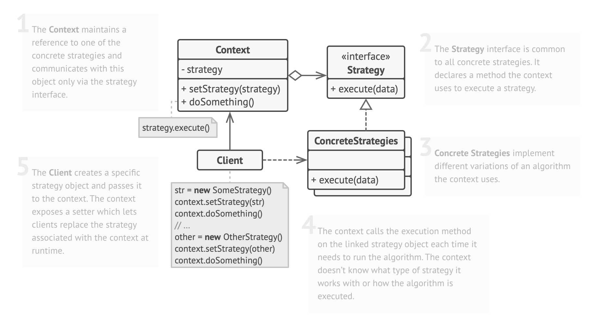

# Examples

- **Thuật toán sắp xếp:** Như đã thể hiện trong ví dụ trước, bạn có thể sử dụng Mẫu Chiến lược để triển khai các thuật toán sắp xếp khác nhau như Bubble Sort, Merge Sort và Quick Sort.

- **Xử lý thanh toán:** Trong ứng dụng thương mại điện tử, bạn có thể có nhiều phương thức thanh toán khác nhau như Thẻ tín dụng, PayPal và Chuyển khoản ngân hàng.

- **Xác thực dữ liệu:** Đối với việc xác thực biểu mẫu trong ứng dụng web, bạn có thể cần nhiều chiến lược xác thực cho từng trường dữ liệu. Mẫu Chiến lược giúp bạn xác định các thuật toán xác thực cho các trường văn bản, trường số và trường email, v.v.

- **Đặt vé du lịch:** Trong ứng dụng đặt vé du lịch, bạn có thể có nhiều chiến lược giá cả, chẳng hạn như Giá thường, Giá giảm giá và Giá ngày lễ. Mẫu Chiến lược có thể giúp bạn áp dụng các chiến lược giá cả khác nhau dựa trên ngày đi du lịch và các yếu tố khác.


# Structure


# Pseudocode

```php
# Step 1: Create the Strategy Interface or Abstract Class
interface Strategy {
    method execute(data)  # The method that represents the behavior or algorithm
}

# Step 2: Implement Concrete Strategies
class ConcreteStrategyA implements Strategy {
    method execute(data) {
        # Implement specific behavior/algorithm A
    }
}

class ConcreteStrategyB implements Strategy {
    method execute(data) {
        # Implement specific behavior/algorithm B
    }
}

# Step 3: Create the Context Class
class Context {
    private strategy  # Reference to the Strategy interface or abstract class

    method setStrategy(strategy) {
        # Setter to set the concrete strategy to be used
    }

    method executeStrategy(data) {
        strategy.execute(data)  # Delegate the execution to the concrete strategy
    }
}

# Step 4: Client Code
context = new Context()

# Use ConcreteStrategyA
context.setStrategy(new ConcreteStrategyA())
context.executeStrategy(data)

# Use ConcreteStrategyB
context.setStrategy(new ConcreteStrategyB())
context.executeStrategy(data)

```

# Pros and Cons
## Pros
- **Flexibility and Reusability:** 
  - Mẫu chiến lược cho phép chuyển đổi (Bubble Sort, Quick Sort, Merge Sort). Chúng ta có thể thêm thuật toán mới mà không cần chỉnh sửa
  - Có thể tái sử dụng thuật toán sắp xếp ở nhiều chỗ khác, tăng tính năng tái sử dụng của mã nguồn.
- **Separation of Concerns:**
  - Mẫu Chiến lược phân tách các chi tiết thực hiện của các thuật toán sắp xếp khỏi mã nguồn của khách hàng sử dụng chúng. Mã nguồn của khách hàng chỉ tương tác với lớp SortContext, không biết cụ thể thuật toán sắp xếp nào đang được sử dụng
  - Phân tách này giúp mã nguồn dễ bảo trì hơn, vì thay đổi các thuật toán sắp xếp không ảnh hưởng đến mã nguồn của khách hàng.
- **Easy Testing:**
  -  Mỗi thuật toán sắp xếp, chẳng hạn như Bubble Sort hoặc Quick Sort, có thể được kiểm thử độc lập.
- **Promotes Composition over Inheritance:**
  - Thay vì sử dụng kế thừa để định nghĩa các biến thể sắp xếp, Mẫu Chiến lược sử dụng hợp thành, linh hoạt hơn. Chúng ta có thể thêm các chiến lược sắp xếp mới mà không cần tạo các cấu trúc lớp phức tạp.
- **Open/Closed Principle:**
  - Mẫu Chiến lược tuân thủ nguyên tắc Mở/Rộng. Chúng ta có thể thêm các chiến lược sắp xếp mới (các chiến lược mới được mở rộng) mà không cần sửa đổi mã nguồn hiện có sử dụng lớp SortContext (mã nguồn hiện có được đóng rồi).

##Cons
- **Increased Complexity:**
  - Sử dụng Mẫu Chiến lược đồng nghĩa với việc thêm nhiều lớp mới như BubbleSort, QuickSort, MergeSort và SortContext, làm tăng độ phức tạp của mã nguồn so với việc triển khai đơn giản của một thuật toán sắp xếp.
  - Đối với các ứng dụng quy mô nhỏ chỉ có một vài phương pháp sắp xếp, Mẫu Chiến lược có thể tạo thêm độ phức tạp không cần thiết.
- **Increased Number of Classes:**
  - Triển khai nhiều chiến lược và lớp ngữ cảnh tăng số lượng lớp trong ứng dụng. Điều này có thể khiến các dự án đơn giản với yêu cầu hạn chế trở nên rối rắm.
- **Indirection Overhead:**
  - Mẫu Chiến lược giới thiệu một lớp trung gian làm gián đoạn trình tự thực hiện công việc, điều này có thể ảnh hưởng đến hiệu suất so với việc gọi trực tiếp một thuật toán sắp xếp cụ thể. Tuy nhiên, chi phí này thường không đáng kể đối với hầu hết các ứng dụng.
- **Selection Logic Responsibility:**
  - Trách nhiệm chọn chiến lược sắp xếp phù hợp có thể nằm ở mã nguồn của khách hàng hoặc thực thể khác. Việc quyết định sử dụng thuật toán sắp xếp nào có thể làm phức tạp quá trình ra quyết định và đưa vào thêm sự phức tạp.
- **Overkill for Simple Scenarios:**
  - Nếu ứng dụng chỉ yêu cầu một thuật toán sắp xếp cố định và không có kế hoạch thay đổi trong tương lai, sử dụng Mẫu Chiến lược có thể là một độ phức tạp không cần thiết. Một câu lệnh if-else đơn giản để chọn thuật toán cũng có thể đủ.
