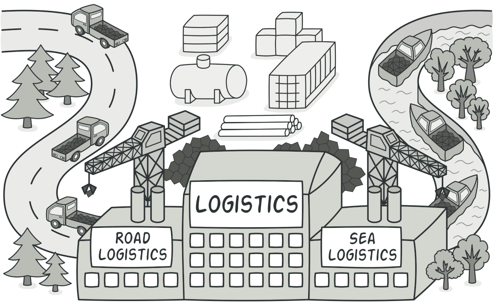
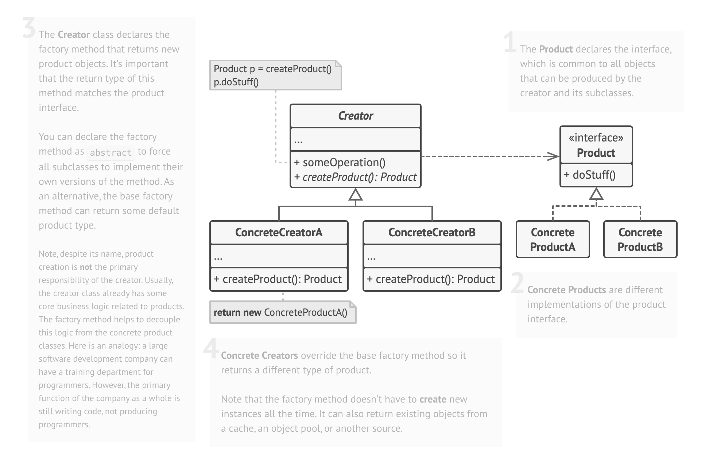

# Intent
**Factory Method** is a creational design pattern that provides an interface for creating objects in a superclass, but allows subclasses to alter the type of objects that will be created.


# Examples

- **Document Creation:** You can creating different types of documents, such as Text Documents,PDFs, and Spreadsheets.

- **Payment Processors:** In a payment processing system, you might need to support multiple payment gateways, such as PayPal, Stripe, and Braintree .

- **GUI Components:** In a graphical user interface, you may have various types of GUI components like buttons, text boxes, and checkboxes.

# Structure


# PseudoCode
```php
// Product Interface: Declare the interface for the products to be created
interface Product
    method operation()

// Concrete Products: Implement the Product interface to create specific products
class ConcreteProductA implements Product
    method operation()
        // Implement the operation for Product A

class ConcreteProductB implements Product
    method operation()
        // Implement the operation for Product B

// Creator Interface: Declare the factory method to create products
interface Creator
    method factoryMethod(): Product

// Concrete Creators: Implement the Creator interface to create specific products
class ConcreteCreatorA implements Creator
    method factoryMethod(): Product
        return new ConcreteProductA()

class ConcreteCreatorB implements Creator
    method factoryMethod(): Product
        return new ConcreteProductB()

// Client Code: Uses the factory method to create products
function clientCode(Creator creator)
    product = creator.factoryMethod()
    product.operation()

// Usage Example:
creatorA = new ConcreteCreatorA()
clientCode(creatorA) // This will create and use ConcreteProductA

creatorB = new ConcreteCreatorB()
clientCode(creatorB) // This will create and use ConcreteProductB

```

# Pros and Cons
