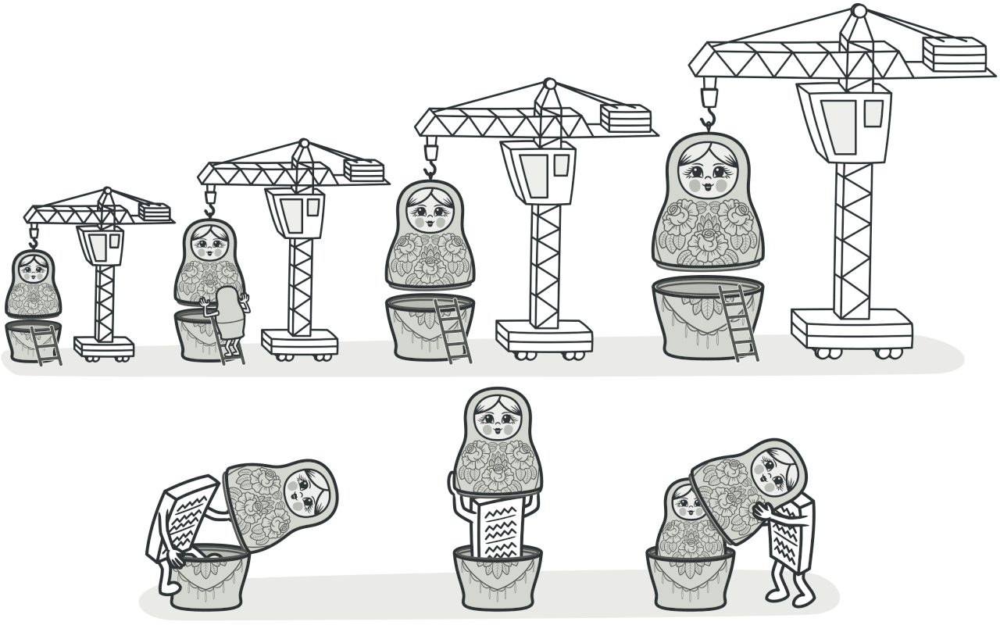
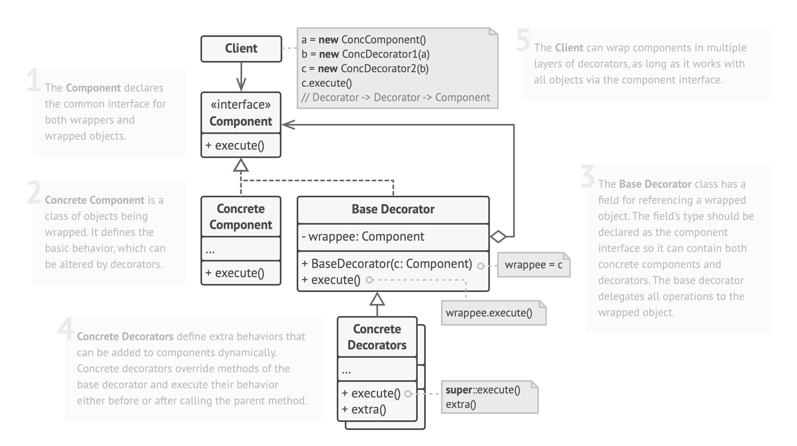

- [1. Intent](#1-intent)
- [2. Examples](#2-examples)
- [3. Structure](#3-structure)
- [4. Pseudocode](#4-pseudocode)
- [5. Pros and Cons](#5-pros-and-cons)
  - [5.1. Example: Text Formatting using Decorator Pattern](#51-example-text-formatting-using-decorator-pattern)
  - [5.2. Pros](#52-pros)
  - [5.3. Cons](#53-cons)

# 1. Intent
Mẫu Decorator là một mẫu thiết kế cấu trúc cho phép bạn gắn các hành vi mới vào các đối tượng bằng cách đặt những đối tượng này vào bên trong các đối tượng bọc đặc biệt chứa các hành vi đó.


# 2. Examples

- **Định dạng văn bản:** Một hệ thống định dạng văn bản có thể sử dụng mẫu Decorator để thêm các chức năng định dạng như đậm, nghiêng, gạch dưới, kích thước chữ, màu sắc văn bản, vv.

- **Coffee Shop:** Trong hệ thống đặt hàng cà phê, mỗi loại cà phê có thể được thêm các phụ gia như sữa, đường, hương vani, vv. Mỗi phụ gia này có thể được thực hiện thông qua các lớp Decorator riêng biệt.

- **Trò chơi:** Trong trò chơi, một nhân vật có thể có nhiều trang bị như giáp, vũ khí, trang sức. Mỗi trang bị này có thể được hiện thực bằng các lớp Decorator.

- **Thông báo gửi email:** Hệ thống thông báo có thể sử dụng mẫu Decorator để thêm các tính năng cho email như chữ ký, tiêu đề, biểu tượng, vv.

# 3. Structure


# 4. Pseudocode

Step 1: Define the Component interface (or abstract class) representing the core functionality.
```php
interface Component:
    operation()

```
Step 2: Implement the Concrete Component representing the core object.
```php
class ConcreteComponent implements Component:
    operation():
        // Core functionality implementation

```
Step 3: Create the Decorator base class that implements the Component interface and maintains a reference to the Component object.
```php
class Decorator implements Component:
    protected component

    constructor(Component component):
        this.component = component

    operation():
        component.operation()

```
Step 4: Implement the Concrete Decorators that extend the Decorator base class and add specific functionalities.
```php
class ConcreteDecoratorA extends Decorator:
    operation():
        // Perform additional behavior before or after calling the Component's operation()
        additionalBehavior()
        component.operation()

class ConcreteDecoratorB extends Decorator:
    operation():
        // Perform additional behavior before or after calling the Component's operation()
        additionalBehavior()
        component.operation()

```
Step 5: Use the decorators to add functionalities to the core component.
```php
// Create the core component
component = new ConcreteComponent()

// Add decorators to the component to extend its functionality
decoratedComponent = new ConcreteDecoratorA(component)
decoratedComponent = new ConcreteDecoratorB(decoratedComponent)

// Use the decorated component, which will now have added functionalities
decoratedComponent.operation()

```

# 5. Pros and Cons
## 5.1. Example: Text Formatting using Decorator Pattern
Let's consider a simple example of a text formatting system, where we have a Text component representing plain text, and we can apply various decorators to add formatting functionalities.

## 5.2. Pros
- Flexible Extension:
  - Sử dụng Mẫu Decorator, chúng ta có thể thêm các tùy chọn định dạng khác nhau, chẳng hạn như in đậm, nghiêng, và gạch chân, vào văn bản thô một cách linh hoạt mà không cần sửa đổi lớp Text. Mỗi decorator đều thêm các định dạng cụ thể, và chúng ta có thể áp dụng nhiều decorator theo bất kỳ tổ hợp nào để đạt được định dạng mong muốn.
- Open/Closed Principle:
  - Lớp Text vẫn mở rộng để mở rộng nhưng đã khép kín để sửa đổi. Các decorator mới có thể được thêm mà không làm thay đổi lớp Text hiện có, đảm bảo rằng các thay đổi định dạng không ảnh hưởng đến chức năng văn bản cốt lõi.
- Single Responsibility Principle:
  - Mỗi lớp decorator (ví dụ: BoldDecorator, ItalicDecorator,...) tập trung vào một trách nhiệm định dạng duy nhất. Điều này làm cho mã nguồn có tổ chức hơn và dễ quản lý các hành vi định dạng cá nhân.
- Composition over Inheritance: 
  - Mẫu Decorator ưu tiên việc kết hợp thay thế kế thừa. Thay vì tạo ra một hệ thống kế thừa lớp riêng biệt cho mỗi tổ hợp định dạng, chúng ta có thể kết hợp các decorator khác nhau để đạt được các kiểu văn bản khác nhau một cách hiệu quả.
- Easy Nesting of Decorators:
  - Chúng ta có thể dễ dàng kết hợp các decorator lên nhau. Ví dụ, chúng ta có thể có một văn bản in đậm với định dạng nghiêng và gạch chân bằng cách kết hợp BoldDecorator, ItalicDecorator, và UnderlineDecorator. Điều này cho phép chúng ta đạt được các tổ hợp định dạng văn bản phức tạp một cách dễ dàng.

## 5.3. Cons
- Increased Complexity:
  - Khi thêm nhiều tùy chọn định dạng và decorator, số lượng các lớp nhỏ trong mã nguồn tăng lên. Quản lý nhiều decorator có thể làm tăng độ phức tạp, đặc biệt nếu không tổ chức một cách hợp lý.
- Order of Wrapping Matters:
  - Thứ tự áp dụng các decorator rất quan trọng. Áp dụng decorator theo thứ tự sai có thể dẫn đến kết quả không mong muốn. Chúng ta cần chú ý để đảm bảo thứ tự decorator đúng để đạt được định dạng văn bản mong muốn.
- Potential Performance Impact:
  - Nếu áp dụng một số lượng lớn các decorator cho một đối tượng văn bản duy nhất, có thể gây ảnh hưởng nhẹ đến hiệu suất do sự bọc lớp nhiều lần. Tuy nhiên, trong hầu hết các trường hợp, tác động này là không đáng kể và không phải là mối quan tâm quan trọng.
- Object Identity Changes:
  - Áp dụng các decorator thay đổi danh tính của đối tượng văn bản ban đầu. Nếu mã nguồn khách hàng phụ thuộc vào danh tính đối tượng để so sánh hoặc lưu trữ tạm thời, có thể gây ra hành vi không mong muốn.
- Potential Overuse:
  - Sử dụng quá nhiều decorator có thể dẫn đến việc tạo ra quá nhiều lớp nhỏ, làm cho mã nguồn khó quản lý và điều hướng.
